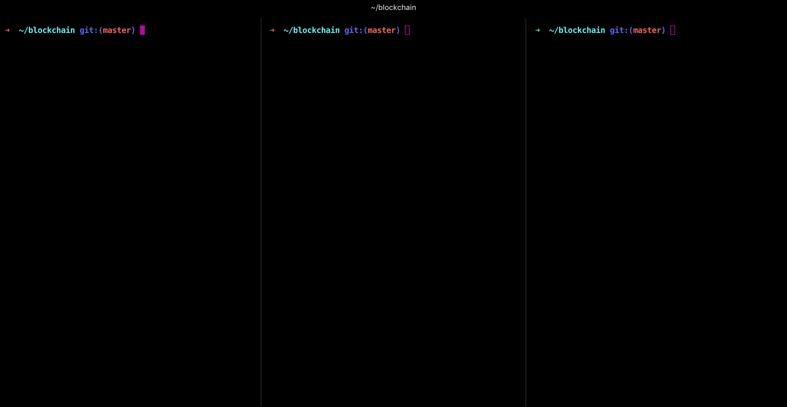

# blockchain.js



> Native blockchain implementation in JavaScript.

## How to use

### Connecting peers

1. Connect two or more peers in seperate terminal sessions.

First, `peer 1` (`npm run peer1`):

```
./node_modules/.bin/cross-env PEER_PORT=6001 HTTP_PORT=3001 node index.js
```

and `peer 2` or (`npm run peer2`):

```
./node_modules/.bin/cross-env PEER_PORT=6002 HTTP_PORT=3002 PEERS=6001 node index.js
```


### Mine the Blockchain

Use curl below to simply execute or just run (`npm run mine`)

```bash
curl --data '{"content" : "Add some data here"}' -H "Content-Type: application/json" http://localhost:3001/mine
```

or you can use [Postman](https://www.getpostman.com/) to execute `POST` requests and mine for blocks.

## Unit Tests

Run the unit tests by executing the following command:

```
npm run test
```

Tests will run using [AVA](https://github.com/avajs) and validate the blockchain technology code to see if it's broken through Q&A scenarios.

Additionally, you can run `npm run lint` to check to see if the code is ESLint compliant.